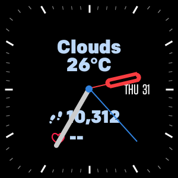

# Obsidian - FitBit Versa Watchface

Obsidian is free, open source Watchface for FitBit Versa. It's Analog watch face with Weather information and activities, heart rate built in. Activities could be changed and cycled by touching status line.

Weather information is from OpenWeather.org by using device location. It'd be updated in every 30 minutes.

Units (e.g. temperature, distance, etc.) displayed based on FitBit app's locale setting.

# Download 

This clockface is available on FitBit Gallery by following link.

https://gam.fitbit.com/gallery/clock/1faf9a7a-9edd-4998-b047-57c93dbd6a62

# Reference

This project uses code from https://github.com/Fitbit/sdk-moment and modified.
Status icons are available from https://github.com/Fitbit/sdk-design-assets and follows Design Assets Licence.